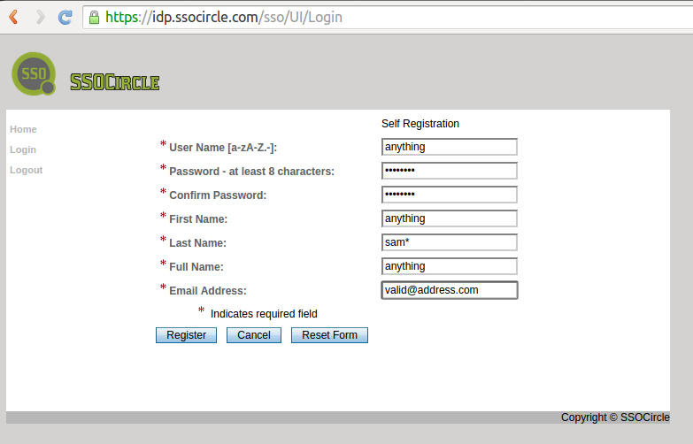
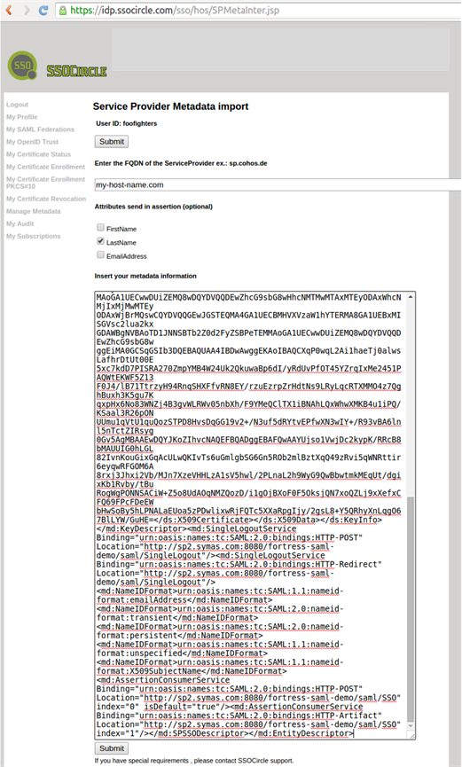
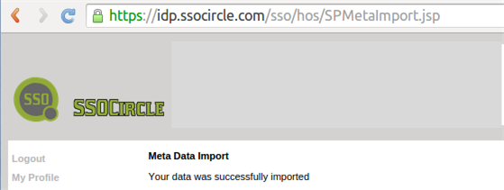

# fortress-saml-sample README-REGISTER-SSOCIRCLE

 Last updated: August 31, 2015

 This document demonstrates how to register for a new account with SSOCircle.com IdP.

-------------------------------------------------------------------------------
## Prerequisites
 Completion [README-DEPLOY-SPRING-SAMPLE.md](README-DEPLOY-SPRING-SAMPLE.md)

-------------------------------------------------------------------------------

## How to enable a new account on SSOCircle.com

1. goto website:

 [http://www.ssocircle.com](SSO Circle IdP)

2. click on Signin/Register->Register

3. fill in the info:

 

 User Name [a-zA-Z.-]:
 this is the userid you will use to log into the SSO Circle Identity Provider (IdP)

 Required Field Password - at least 8 characters:
 this is the password you will use to log into the IdP

 Required Field First Name:
 enter anything

 Required Field Last Name:
 enter: sam*

 note: this field maps to a fortress userid.  For now use 'sam*' will be given full access to fortress-saml-sample web app.

 Required Field Full Name:
 anything

 Required Field Email Address:
 this email address must be valid.  it is needed for registration confirmation later.

4. complete the registration via confirmation message sent to email address entered above.

5. login into SSOCircle.com IdP

 Enter the *User Name* and *Password* from above.

 

6. Add Service Provider Metadata to SSOCircle.com

 a. click on *Manager Metadata

 b. click on *Add new Service Provider
 

 c. Enter the FQDN of the ServiceProvider ex.: sp.cohos.de

 enter hostname for your tomcat machine

 d. enable the 'LastName' checkboxe:

 e. click on 'Submit' button

 f. wait for the confirmation message (could take a couple of minutes)
 