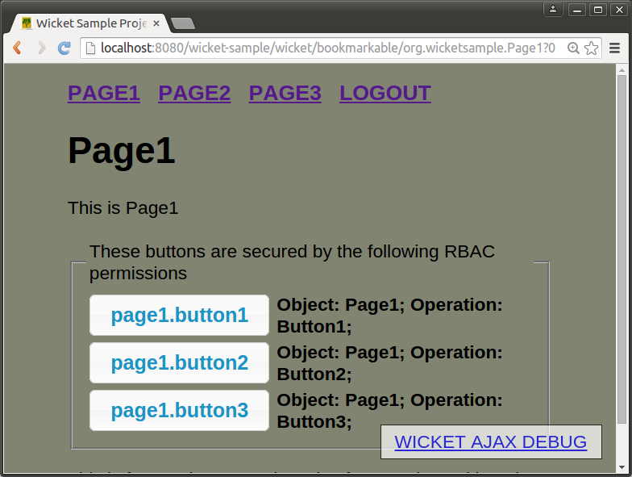

# fortress-saml-sample README

 Last updated: August 31, 2015

 This document demonstrates how to build and deploy the fortress saml sample.

-------------------------------------------------------------------------------
## Prerequisites
1. Java 7 (or greater) sdk
2. Git
3. Apache Maven 3
4. Completion of these steps under the [Apache Fortress Ten Minute Guide](http://directory.apache.org/fortress/gen-docs/latest/apidocs/org/apache/directory/fortress/core/doc-files/ten-minute-guide.html):
    * [Setup Apache Directory Server](http://directory.apache.org/fortress/gen-docs/latest/apidocs/org/apache/directory/fortress/core/doc-files/apache-directory-server.html)
    * [Setup Apache Directory Studio](http://directory.apache.org/fortress/gen-docs/latest/apidocs/org/apache/directory/fortress/core/doc-files/apache-directory-studio.html)
    * [Build Apache Fortress Core](http://directory.apache.org/fortress/gen-docs/latest/apidocs/org/apache/directory/fortress/core/doc-files/apache-fortress-core.html)
    * [Build Apache Fortress Realm](http://directory.apache.org/fortress/gen-docs/latest/apidocs/org/apache/directory/fortress/core/doc-files/apache-fortress-realm.html)
    * [Setup Apache Tomcat Web Server](http://directory.apache.org/fortress/gen-docs/latest/apidocs/org/apache/directory/fortress/core/doc-files/apache-tomcat.html)
    * [Build Apache Fortress Web](http://directory.apache.org/fortress/gen-docs/latest/apidocs/org/apache/directory/fortress/core/doc-files/apache-fortress-web.html)

-------------------------------------------------------------------------------
## How to build and deploy
1. [Download ZIP](https://github.com/shawnmckinney/fortress-saml-sample/archive/master.zip)

2. Extract the zip archive to your local machine.

3. cd fortress-saml-sample-master

4.

5.

6.

7.

8.

9.

10.


4. Set java and maven home env variables.

5. Run this command from the root package:
```
mvn clean tomcat:deploy
```
 *Note: if problem  with auto-deploy, manually deploy wicket-sample.war to webapps*

-------------------------------------------------------------------------------
## How to test
1. Open link to [http://localhost:8080/wicket-sample](http://localhost:8080/wicket-sample)

 

2. click on the page links

3. click on the buttons

4. *Notice that there is no security enabled for this app*

-------------------------------------------------------------------------------
## How to enable security
 Follow the instructions here: [README-ENABLE-FORTRESS.md](README-ENABLE-FORTRESS.md)