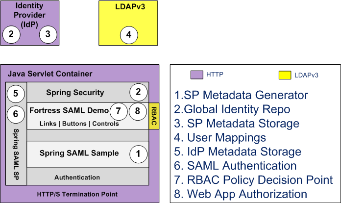
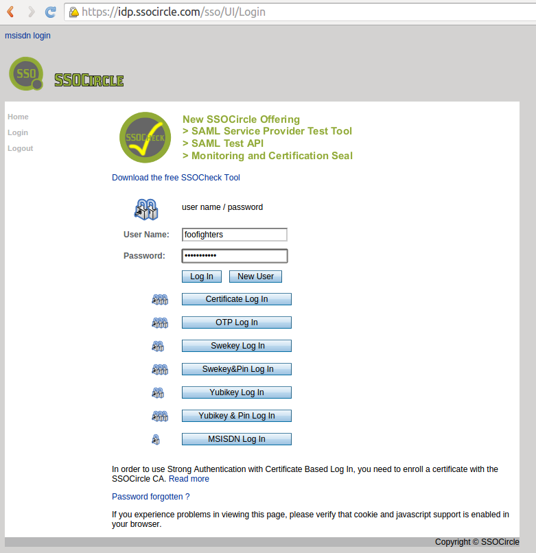
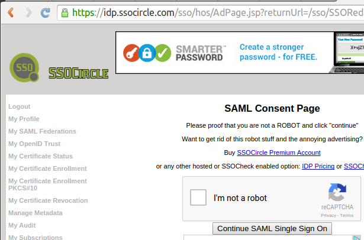
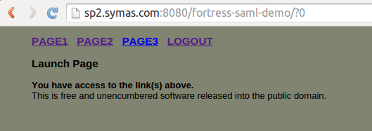
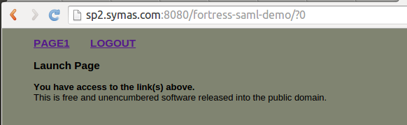

# Overview of the fortress-saml-demo README

 

 * This document demonstrates how to build and deploy the fortress saml sample.
 * It builds on two excellent references:
  * [spring-security-saml](https://github.com/spring-projects/spring-security-saml) - Spring's SAML sample is the first place java developers should look for basic SAML 2.0 programming concepts..
  * [shibboleth-sample-java-sp](https://github.com/UniconLabs/shibboleth-sample-java-sp) - Unicon's sample is where ones goes to understand how to combine Spring SAML's SP with Shibboleth's IdP.
 * The fortress-saml-demo is a third step.  It hooks [Apache Directory Fortress](https://directory.apache.org/fortress/) with [Spring Security SAML](http://projects.spring.io/spring-security-saml/)
   and a common Identity Provider - [SSO Circle.com](http://www.ssocircle.com).
 * Using a common IdP allows focus on the Service Provider side initially.  Later, after we get more comfortable with how the metadata works, we can change to use another form of IdP, i.e. Shibboleth v3.
 * Here we show how Fortress may be combined with Spring Security to satisfy rudimentary SAML authentication and RBAC authorization requirements.
 * This demo doesn't cover the various SAML 2.0 use cases possible.  For that refer back to the spring saml sample.
 * We use the Apache Wicket web framework for app.  To learn the details of combining Apache Wicket and Fortress, check out:
 [wicket-sample](https://github.com/shawnmckinney/wicket-sample)

-------------------------------------------------------------------------------
## Prerequisites
1. Java 8
2. Apache Maven 3++
3. Apache Tomcat 8++
4. Basic LDAP server setup by completing one of these:
    * [OpenLDAP & Fortress QUICKSTART](https://github.com/apache/directory-fortress-core/blob/master/README-QUICKSTART-SLAPD.md)
    * [OpenLDAP & Fortress QUICKSTART on DOCKER](https://github.com/apache/directory-fortress-core/blob/master/README-QUICKSTART-DOCKER-SLAPD.md)
    * [APACHEDS & Fortress QUICKSTART](https://github.com/apache/directory-fortress-core/blob/master/README-QUICKSTART-APACHEDS.md)    
    * [APACHEDS & Fortress QUICKSTART on DOCKER](https://github.com/apache/directory-fortress-core/blob/master/README-QUICKSTART-DOCKER-APACHEDS.md)

-------------------------------------------------------------------------------
## Generate SP metadata and register with IdP ssocircle.com

#### 1. Complete first: [SPRING-SECURITY-SAML2-SAMPLE.md](SPRING-SECURITY-SAML2-SAMPLE.md)

#### 2. Complete next: [REGISTER-SSOCIRCLE.md](REGISTER-SSOCIRCLE.md)

## Prepare fortress-saml-demo package

#### 1. Get the project source:

 a. Download zip from project:

 ```
 wget https://github.com/shawnmckinney/fortress-saml-demo/archive/master.zip
 cd fortress-saml-demo-master
 ```

 -OR do this-

 b. Clone the project git repo:

 ```
 git clone https://github.com/shawnmckinney/fortress-saml-demo.git
 cd fortress-saml-demo
 ```

#### 3. Rename [fortress.properties.example](src/main/resources/fortress.properties.example) to fortress.properties.

 Pick either Apache Directory or OpenLDAP server:

 c. Prepare fortress for ApacheDS usage:

 ```properties
 # This param tells fortress what type of ldap server in use:
 ldap.server.type=apacheds

 # Use value from [Set Hostname Entry]:
 host=localhost

 # ApacheDS defaults to this:
 port=10389

 # These credentials are used for read/write access to all nodes under suffix:
 admin.user=uid=admin,ou=system
 admin.pw=secret
 ```

 -- Or --

 d. Prepare fortress for OpenLDAP usage:

 ```properties
 # This param tells fortress what type of ldap server in use:
 ldap.server.type=openldap

 # Use value from [Set Hostname Entry]:
 host=localhost

 # OpenLDAP defaults to this:
 port=389

 # These credentials are used for read/write access to all nodes under suffix:
 admin.user=cn=Manager,dc=example,dc=com
 admin.pw=secret
 ```

#### 4. Edit  file, bean id **metadataGeneratorFilter**, replace the property **entityId**'s value with what you used during the [SPRING-SECURITY-SAML2-SAMPLE.md](SPRING-SECURITY-SAML2-SAMPLE.md) setup:

 ```
 <!-- SSOCircle.com IDP Metadata configuration: -->
    <bean id="metadataGeneratorFilter" class="org.springframework.security.saml.metadata.MetadataGeneratorFilter">
        <constructor-arg>
            <bean class="org.springframework.security.saml.metadata.MetadataGenerator">
                <property name="entityId" value="fortress-saml-demo"/>
                <property name="extendedMetadata">
                    <bean class="org.springframework.security.saml.metadata.ExtendedMetadata">
                        <property name="signMetadata" value="false"/>
                        <property name="idpDiscoveryEnabled" value="false"/>
                    </bean>
                </property>
            </bean>
        </constructor-arg>
    </bean>
 ```

#### 5. View (don't change)  file, bean id **metadata**, check out the url to idp.ssocircle.com.  This is one way to enable an IdP's metadata:

 ```
 <!-- SSOCircle.com IDP Metadata configuration - paths to metadata of IDPs in circle of trust is here -->
 <bean id="metadata" class="org.springframework.security.saml.metadata.CachingMetadataManager">
     <constructor-arg>
         <list>
             <bean class="org.opensaml.saml2.metadata.provider.HTTPMetadataProvider">
                 <constructor-arg>
                     <value type="java.lang.String">http://idp.ssocircle.com/idp-meta.xml</value>
                 </constructor-arg>
                 <constructor-arg>
                     <value type="int">5000</value>
                 </constructor-arg>
                 <property name="parserPool" ref="parserPool"/>
             </bean>
         </list>
     </constructor-arg>
 </bean>
 ```
 **TODO**: enable another IdP in future, for example Shibboleth.

-------------------------------------------------------------------------------
## Prepare Tomcat for Java EE Security

This sample web app uses Java EE security.

#### 1. Download the fortress realm proxy jar into tomcat/lib folder:

  ```
  wget https://repo.maven.apache.org/maven2/org/apache/directory/fortress/fortress-realm-proxy/2.0.5/fortress-realm-proxy-2.0.5.jar -P $TOMCAT_HOME/lib
  ```

  where *TOMCAT_HOME* matches your target env.

#### 2. Prepare tomcat to allow autodeploy of web app:

 ```
 sudo vi /usr/local/tomcat8/conf/tomcat-users.xml
 ```

#### 3. Add tomcat user for autodeploy of web app:

 ```
 <role rolename="manager-script"/>
 <role rolename="manager-gui"/>
 <user username="tcmanager" password="m@nager123" roles="manager-script"/>
 ```

#### 4. Restart tomcat for new settings to take effect.

 Note: The proxy is a shim that uses a [URLClassLoader](http://docs.oracle.com/javase/7/docs/api/java/net/URLClassLoader.html) to reach its implementation libs.  It prevents
 the realm impl libs, pulled in as dependency to web app, from interfering with the container’s system classpath thus providing an error free deployment process free from
 classloader issues.  The proxy offers the flexibility for each web app to determine its own version/type of security realm to use, satisfying a variety of requirements
 related to web hosting and multitenancy.

-------------------------------------------------------------------------------
## Build and deploy fortress-saml-demo

#### 1. Verify the java and maven home env variables are set.

 ```maven
 mvn -version
 ```

 This sample requires Java 8 and Maven 3 to be setup within the execution env.

#### 2. Run this command from the root package:

 Deploy to tomcat server:

 ```maven
 mvn clean tomcat:deploy -Dload.file
 ```

 Or if already deployed:

 ```maven
 mvn clean tomcat:redeploy -Dload.file
 ```

 -Dload.file tells maven to automatically load the fortress-saml-demo security policy into ldap.  Since the load needs to happen just once, you may drop the arg from future ops:

 ```maven
mvn tomcat:redeploy
 ```

 **Note**: if problem  with tomcat auto-deploy, manually deploy fortress-saml-demo.war to webapps or change connection info used during tomcat:deploy in [pom.xml](pom.xml). 

 ```
 <plugin>
     <groupId>org.codehaus.mojo</groupId>
     <artifactId>tomcat-maven-plugin</artifactId>
     <version>1.0-beta-1</version>
     <configuration>
     ...
         <url>http://localhost:8080/manager/text</url>
         <path>/${project.artifactId}</path>
         <!-- Warning the tomcat manager creds here are for deploying into a demo environment only. -->
         <username>tcmanager</username>
         <password>m@nager123</password>
     </configuration>
 </plugin>
 ```

-------------------------------------------------------------------------------

## Test fortress security with spring saml sso enabled

 To get understanding of security policy of this web app, check out .

 excerpt from file:

 ```
 ...
 <adduserrole>
     <userrole userId="sam1" name="samRole1" />
     <userrole userId="sam2" name="samRole2" />
     <userrole userId="sam3" name="samRole3" />
     <userrole userId="sam*" name="samSuperRole" />
 </adduserrole>

 <addpermgrant>
     <permgrant objName="Page1" opName="link" roleNm="samRole1"/>
     <permgrant objName="Page2" opName="link" roleNm="samRole2"/>
     <permgrant objName="Page3" opName="link" roleNm="samRole3"/>
     <permgrant objName="Page1" opName="Button1" roleNm="samRole1"/>
     <permgrant objName="Page1" opName="Button2" roleNm="samRole1"/>
     <permgrant objName="Page1" opName="Button3" roleNm="samRole1"/>
     <permgrant objName="Page2" opName="Button1" roleNm="samRole2"/>
     <permgrant objName="Page2" opName="Button2" roleNm="samRole2"/>
     <permgrant objName="Page2" opName="Button3" roleNm="samRole2"/>
     <permgrant objName="Page3" opName="Button1" roleNm="samRole3"/>
     <permgrant objName="Page3" opName="Button2" roleNm="samRole3"/>
     <permgrant objName="Page3" opName="Button3" roleNm="samRole3"/>
 </addpermgrant>
 ...
 ```

 There are three pages, each page has three buttons.  Page access is granted as follows:

| user          | page1         | page2         | page3         |
| ------------- | ------------- | ------------- | ------------- |
| sam*          | true          | true          | true          |
| sam1          | true          | false         | true          |
| sam2          | false         | true          | false         |
| sam3          | false         | false         | true          |

 If you followed the instructions, your IdP global user will be mapped to sam* in fortress which grants access to all pages/buttons in the app.  This mapping can be changed, which we'll show you how later.

#### 1. Open link to [http://localhost:8080/fortress-saml-demo](http://localhost:8080/fortress-saml-demo)

#### 2. You will be redirected to the Identity Provider's website.  Enter the **User Name**, **Password** values from the [REGISTER-SSOCIRCLE.md](REGISTER-SSOCIRCLE.md) steps.
 

#### 3. Click on the **I'm not a robot** checkbox, answer the questions, and finally click on the **Continue SAML Single Sign On** button.
 

#### 4. If everything works when redirecting back to the SP, you'll see the fortress-saml-demo **Launch Page**, where the user, sam*, has all links enabled:
 

#### 5. Try a different user...
 * Map to different fortress users at [**MY Profile**](https://idp.ssocircle.com/sso/hos/SelfCare.jsp) page on ssocircle.com.
 * Enter a new **Surname**.  (Originally called **Last Name** when profile first created - both refer to same field)
 * Pick from one of these: sam1, sam2, sam3 or sam*.
 * Be sure to enter the original IdP password in **Old password** field before clicking on the **Submit** button to save your changes.

 
 * Delete the cookies from browser corresponding with the IdP and SP websites.
 * Now, go back to Step 1 and login again.  Will be different authorizations corresponding with other userIds mapped when redirected to **Launch Page**.


#### 6. Each fortress userId (mapped to **Last Name** field at IdP) has different access policy.
 * sam1 - access to page one
 * sam2 - access to page two
 * sam3 - access to page three
 * sam* - access to all pages

## Common Errors During Testing

#### 1. Invalid Entity Id registered with SSO Circle.com.  If authentication succeeds with IdP, but the redirect to fortress-saml-demo fails with this error in browser.
 

#### 2. Authentication succeeds, but keep getting routed back to SSO circle page.
 * Make sure the fortress saml test security policy was loaded, and that the SSO circle.com user profile has mapping the last name field to one of the users setup in Fortress, e.g. sam1, sam2, sam3.
 * It also *could* be a browser compatibility problem.
 
#### 3. Other things to watch out for... 
 * The host machine not time synched: Synch with current and retry.
 * The authentication token has expired: Logout of SSOCircle.com and retry.
 * Not using *exactly* the same URL as when generating SP metadata here: [SPRING-SECURITY-SAML2-SAMPLE.md](SPRING-SECURITY-SAML2-SAMPLE.md).
 
#### 4. Troubleshooting

1. Can't login with a valid user.

Was the fortress load step run?

```java
mvn install -Dload.file
``` 
 
2. Can login to sample, but no links or buttons are displayed on the landing page.

Has another fortress sample app been tested?  It's possible that the permission grants were overridden by that other sample in which case run this sample's load again.

3. Some other unidentified error.  View the Tomcat logs to get more clues.

Change the granularity of the loggers in [log4j.properties](src/main/resources/log4j.properties) and redeploy.

```java
log4j.logger.org.wicketsample=DEBUG
log4j.logger.org.apache.directory.fortress.web=DEBUG
log4j.logger.org.apache.directory.fortress.core=DEBUG
log4j.logger.org.apache.directory.fortress.realm=DEBUG
``` 
#### 4. Final notes...
 * URL exactly same means same protocol (http/https), host name, port, context -- all must match.
 * Authorization error means user probably doesn't have the defined role, i.e. that matching what was placed in surnamne field of SSOCircle.com user profile.
 
 * Read the logs under TOMCAT_HOME/logs, default catalina.out.
 * As of Spring Security 4.0, CSRF protection is enabled by default with XML configuration. This has caused an issue where pages are failing check.
 The workaround, disable CSRF checkin the [Spring Security Config File](src/main/webapp/WEB-INF/securityContext.xml).
 ```xml
    <security:http entry-point-ref="samlEntryPoint" use-expressions="false">
        ...
        <security:csrf disabled="true" />
    </security:http>
```
   
 TODO: Selective activation of CSRF checking using a request matcher: 
 ```xml
    <security:http entry-point-ref="samlEntryPoint" use-expressions="false">
        ...
        <security:csrf request-matcher-ref="csrfSecurityRequestMatcher"/>
    </security:http>
```
 Defined in [CsrfSecurityRequestMatcher](src/main/java/org/samlsample/control/CsrfSecurityRequestMatcher.java)
 ```java
@EnableWebSecurity
public class CsrfSecurityRequestMatcher implements RequestMatcher
{
    private Pattern allowedMethods = Pattern.compile("^(GET|HEAD|TRACE|OPTIONS)$");
    private RegexRequestMatcher unprotectedMatcher = new RegexRequestMatcher("^/saml/SSO(.*)", null);
    ...
}
```
 