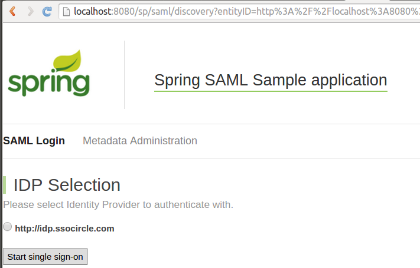
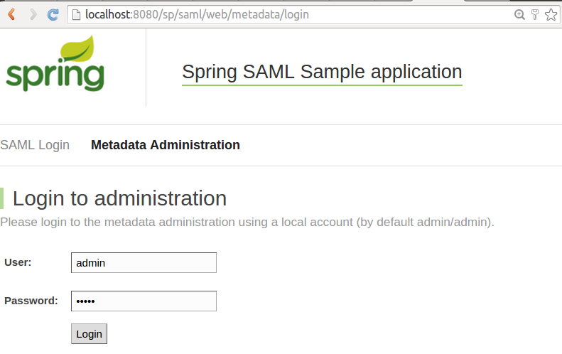
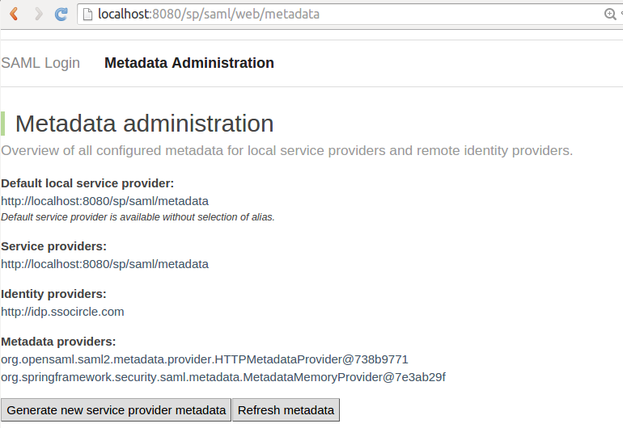

# fortress-saml-sample SPRING-SECURITY-SAML2-SAMPLE

 This document describes how to download and install Unicon's [shibboleth-sample-java-sp](https://github.com/UniconLabs/shibboleth-sample-java-sp) sample.

 This document also describes how to use the shibboleth-sample-java-sp app to generate metadata needed later to register the fortress-saml-demo *Service Provider* with the ssocircle.com *Identity Provider*.

 Alternatively, the [spring-security-saml-sample](https://github.com/spring-projects/spring-security-saml/tree/master/sample) may be used to do the same thing (generate SP metadata) but those steps are not here.

-------------------------------------------------------------------------------

## Prerequisites
1. Java 8 sdk
2. Gradle - to build shibboleth-sample-java-sp
3. Tomcat8 - to deploy shibboleth-sample-java-sp

-------------------------------------------------------------------------------

#### 1. Download package and extract:

 [shibboleth-sample-java-sp](https://github.com/UniconLabs/shibboleth-sample-java-sp/archive/master.zip)

#### 2. Edit securityContext.xml file:

  file, replace the **metadata** bean declaration with:

 ```
 <bean id="metadata" class="org.springframework.security.saml.metadata.CachingMetadataManager">
    <constructor-arg>
        <list>
            <bean class="org.opensaml.saml2.metadata.provider.HTTPMetadataProvider">
                <constructor-arg>
                    <value type="java.lang.String">http://idp.ssocircle.com/idp-meta.xml</value>
                </constructor-arg>
                <constructor-arg>
                    <value type="int">5000</value>
                </constructor-arg>
                <property name="parserPool" ref="parserPool"/>
            </bean>
        </list>
    </constructor-arg>
 </bean>
 ```

#### 3. Pull down IdP metadata from ssocircle.com

 ```
 wget http://idp.ssocircle.com/idp-meta.xml -o /tmp/idp-metadata.xml
 ```

#### 4. Edit the sp.properties file:

  file.
 replace the *idp.metadata* tag with a pointer to file just downloaded to local harddrive:

 ```
 idp.metadata=/tmp/idp-metadata.xml
 ```

#### 5. Deploy shibboleth-sample-java-sp package
 follow the  steps to build and deploy.

#### 6. Pull up the shibboleth-sample-java-sp home page in the browser:

 a. Use this URL: [http://localhost:8080/sp](Spring Saml Landing Page)
 b. Looks like this:

 

#### 7. Click on **Metadata Administration** link.

#### 8. Accept default uid/password, and click on **Login** button

 

#### 9. Click on **Generate new service provider metadata** button

 

#### 10. Entity Id

 enter a unique value

 e.g. *fortress-saml-demo*

 **Remember this value**  It is used inside the  file during the [fortress-saml-demo](README.md) setup and links SP with the IdP.

#### 11. Entity Base URL:

 e.g. *http://host-name:8080/fortress-saml-demo*  (where **host-name** corresponds with your machine's host name)

 **Remember this value**: The host-name will be entered during the [REGISTER-SSOCIRCLE.md](REGISTER-SSOCIRCLE.md) setup.

 

#### 12. Click on **Generate Metadata** button at the bottom of the page

 

#### 13. Copy the buffer

 

#### 14. Create a new file:

 Save it with an '.xml' extension.  We'll need it later on during the [REGISTER-SSOCIRCLE.md](REGISTER-SSOCIRCLE.md) steps.

 **Save this file** It is needed during the [REGISTER-SSOCIRCLE.md](REGISTER-SSOCIRCLE.md) setup.

#### 15. Complete the steps under

 **How to enable a new account on SSOCircle.com** section of the [REGISTER-SSOCIRCLE.md](REGISTER-SSOCIRCLE.md) doc.